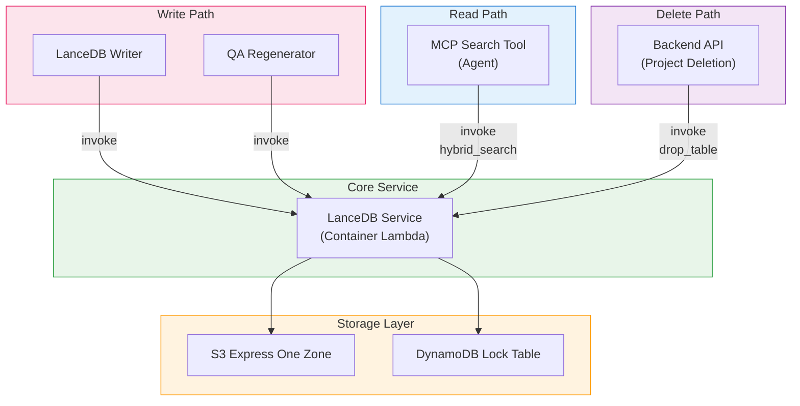

<h1 align="center">Vector Database (LanceDB + Kiwi)</h1>

<p align="center">
  <strong>Serverless Vector Storage and Korean Morphological Search</strong>
</p>
<p align="center">
  
  
  
  
  
</p>

<p align="center">
  <strong>English</strong> | <a href="VECTORDB_ko.md">한국어</a> | <a href="VECTORDB_ja.md">日本語</a>
</p>

---

## Overview

This project uses [LanceDB](https://lancedb.com/) as the vector database instead of Amazon OpenSearch Service. LanceDB is an open-source, serverless vector database that stores data directly on S3, eliminating the need for dedicated cluster infrastructure. Combined with [Kiwi](https://github.com/bab2min/Kiwi), a Korean morphological analyzer, it enables hybrid search (vector + full-text) with Korean language support.

### Why LanceDB for PoC?

This project is a **PoC/prototype**, and cost efficiency is a key factor.

| Factor | OpenSearch Service | LanceDB (S3) |
|--------|-------------------|---------------|
| Infrastructure | Dedicated cluster (minimum 2-3 nodes) | No cluster needed (serverless) |
| Idle cost | Charges even when unused | S3 storage only |
| Setup complexity | Domain config, VPC, access policies | S3 bucket + DynamoDB lock table |
| Scaling | Node scaling required | Scales with S3 automatically |
| Estimated monthly cost (PoC) | $200-500+ (t3.medium x2 minimum) | $1-10 (S3 + DDB on-demand) |

> **Note**: OpenSearch provides richer features (dashboards, k-NN plugin, fine-grained access control) suitable for production workloads. See [Migration to OpenSearch](#migration-to-opensearch) for a transition guide.

---

## Architecture

```
Write Path:
  Analysis Finalizer → SQS (Write Queue) → LanceDB Writer Lambda
    → LanceDB Service Lambda (Container)
        ├─ Kiwi: keyword extraction
        ├─ Bedrock Nova: vector embedding (1024d)
        └─ LanceDB: store to S3 Express One Zone

Read Path:
  MCP Search Tool Lambda
    → LanceDB Service Lambda (Container): hybrid search (vector + FTS)
    → Bedrock Claude Haiku: summarize search results

Delete Path:
  Backend API (project deletion)
    → LanceDB Service Lambda: drop_table
```

### Storage Architecture

```
S3 Express One Zone (Directory Bucket)
  └─ idp-v2/
      ├─ {project_id_1}/     ← one LanceDB table per project
      │   ├─ data/
      │   └─ indices/
      └─ {project_id_2}/
          ├─ data/
          └─ indices/

DynamoDB (Lock Table)
  PK: base_uri  |  SK: version
  └─ Manages concurrent access to LanceDB tables
```

---

## Components

### 1. LanceDB Service Lambda (Container Image)

The core vector DB service. Uses a Docker container image because `lancedb` and `kiwipiepy` together exceed the 250MB Lambda deployment limit.

| Item | Value |
|------|-------|
| Function Name | `idp-v2-lancedb-service` |
| Runtime | Python 3.12 (Container Image) |
| Memory | 2048 MB |
| Timeout | 5 min |
| Base Image | `public.ecr.aws/lambda/python:3.12` |
| Dependencies | `lancedb>=0.26.0`, `kiwipiepy>=0.22.0`, `boto3` |

**Supported Actions:**

| Action | Description |
|--------|-------------|
| `add_record` | Add a document segment (keyword extraction + embedding + store) |
| `delete_record` | Delete a segment by ID |
| `get_segments` | Retrieve all segments for a workflow |
| `hybrid_search` | Hybrid search (vector + FTS, `query_type='hybrid'`) |
| `list_tables` | List all project tables |
| `count` | Count records in a project table |
| `delete_by_workflow` | Delete all records for a workflow |
| `drop_table` | Drop an entire project table |

**Why Container Lambda:**

Kiwi's Korean language model files and LanceDB's native binaries total several hundred MB, exceeding Lambda's 250MB zip limit. Using a Docker container image (up to 10GB) resolves this constraint.

### 2. LanceDB Writer Lambda

An SQS consumer that receives write requests from the analysis pipeline and delegates to the LanceDB Service.

| Item | Value |
|------|-------|
| Function Name | `idp-v2-lancedb-writer` |
| Runtime | Python 3.14 |
| Memory | 256 MB |
| Timeout | 5 min |
| Trigger | SQS (`idp-v2-lancedb-write-queue`) |
| Concurrency | 1 (sequential processing) |

Concurrency is set to 1 to prevent concurrent write conflicts on LanceDB tables.

### 3. MCP Search Tool

The Agent's MCP tool invokes the LanceDB Service Lambda directly to perform document retrieval during AI chat.

```
User Query → Bedrock Agent Core → MCP Gateway
  → Search Tool Lambda → LanceDB Service Lambda (hybrid_search)
    → Bedrock Claude Haiku: summarize search results → Response
```

| Item | Value |
|------|-------|
| Stack | McpStack |
| Runtime | Node.js 22.x (ARM64) |
| Timeout | 30s |
| Environment | `LANCEDB_FUNCTION_ARN` (via SSM) |

---

## Data Schema

Each document segment is stored with the following schema:

```python
class DocumentRecord(LanceModel):
    workflow_id: str            # Workflow ID
    document_id: str            # Document ID
    segment_id: str             # "{workflow_id}_{segment_index:04d}"
    segment_index: int          # Segment page/chapter number
    content: str                # content_combined (SourceField for embedding)
    vector: Vector(1024)        # Bedrock Nova embedding (VectorField)
    keywords: str               # Kiwi-extracted keywords (FTS indexed)
    file_uri: str               # Original file S3 URI
    file_type: str              # MIME type
    image_uri: Optional[str]    # Segment image S3 URI
    created_at: datetime        # Timestamp
```

- **One table per project**: Table name = `project_id`
- **`content`**: Merged text from all preprocessing (OCR + BDA + PDF text + AI analysis)
- **`vector`**: Auto-generated by LanceDB's embedding function (Bedrock Nova, 1024 dimensions)
- **`keywords`**: Kiwi-extracted Korean morphemes for full-text search (FTS index)

---

## Kiwi: Korean Morphological Analyzer

[Kiwi (Korean Intelligent Word Identifier)](https://github.com/bab2min/Kiwi) is an open-source Korean morphological analyzer written in C++ with Python bindings (`kiwipiepy`).

### Why Kiwi?

LanceDB's built-in FTS tokenizer does not support Korean. Korean is an agglutinative language where words cannot be separated by spaces alone. For example:

```
Input:  "인공지능 기반 문서 분석 시스템을 구축했습니다"
Kiwi:   "인공 지능 기반 문서 분석 시스템 구축"  (nouns extracted)
```

Without morphological analysis, searching for "시스템" would miss documents containing "시스템을" or "시스템에서".

### Extraction Rules

| POS Tag | Description | Example |
|---------|-------------|---------|
| NNG | Common noun | 문서, 분석, 시스템 |
| NNP | Proper noun | AWS, Bedrock |
| NR | Numeral | 하나, 둘 |
| NP | Pronoun | 이것, 그것 |
| SL | Foreign word | Lambda, Python |
| SN | Number | 1024, 3.5 |
| SH | Chinese character | |
| XSN | Suffix | Attached to previous token |

**Filters:**
- Single-character Korean stop words: 것, 수, 등, 때, 곳
- Single-character foreign words, numbers, and Chinese characters are preserved

---

## Hybrid Search Flow

All searches are processed by the LanceDB Service Lambda. It uses LanceDB's native `query_type='hybrid'` to combine vector search and full-text search.

```
Search Query: "문서 분석 결과 조회"
  │
  ├─ [1] Kiwi keyword extraction (LanceDB Service Lambda)
  │     → "문서 분석 결과 조회"
  │
  ├─ [2] LanceDB native hybrid search
  │     → table.search(query=keywords, query_type='hybrid')
  │     → Vector search (Nova embedding) + FTS auto-merged
  │     → Top-K results with _relevance_score
  │
  └─ [3] Result summarization (MCP Search Tool Lambda)
        → Bedrock Claude Haiku generates answer from search results
```

---

## Infrastructure (CDK)

### S3 Express One Zone

```typescript
// StorageStack
const expressStorage = new CfnDirectoryBucket(this, 'LanceDbExpressStorage', {
  bucketName: `idp-v2-lancedb--use1-az4--x-s3`,
  dataRedundancy: 'SingleAvailabilityZone',
  locationName: 'use1-az4',
});
```

S3 Express One Zone provides single-digit millisecond latency, optimized for frequent read/write patterns like vector search operations.

### DynamoDB Lock Table

```typescript
// StorageStack
const lockTable = new Table(this, 'LanceDbLockTable', {
  partitionKey: { name: 'base_uri', type: AttributeType.STRING },
  sortKey: { name: 'version', type: AttributeType.NUMBER },
  billingMode: BillingMode.PAY_PER_REQUEST,
});
```

Manages distributed locking when multiple Lambda functions access the same dataset concurrently.

### SSM Parameters

| Key | Description |
|-----|-------------|
| `/idp-v2/lancedb/lock/table-name` | DynamoDB lock table name |
| `/idp-v2/lancedb/express/bucket-name` | S3 Express bucket name |
| `/idp-v2/lancedb/express/az-id` | S3 Express availability zone ID |
| `/idp-v2/lancedb/function-arn` | LanceDB Service Lambda function ARN |

---

## Component Dependency Map

The following diagram shows all components that depend on LanceDB:



| Component | Stack | Access Type | Description |
|-----------|-------|-------------|-------------|
| **LanceDB Service** | WorkflowStack | Read/Write | Core DB service (Container Lambda) |
| **LanceDB Writer** | WorkflowStack | Write (via Service) | SQS consumer, delegates to Service |
| **Analysis Finalizer** | WorkflowStack | Write (via SQS/Service) | Sends segments to write queue, deletes on reanalysis |
| **QA Regenerator** | WorkflowStack | Write (via Service) | Updates Q&A segments |
| **MCP Search Tool** | McpStack | Read (direct Service invoke) | Agent tool for document retrieval |
| **Backend API** | ApplicationStack | Delete (via Service) | Invokes `drop_table` on project deletion |

---

## Migration to OpenSearch

If migrating to Amazon OpenSearch Service for production, the following components need modification:

### Components to Replace

| Component | Current (LanceDB) | Target (OpenSearch) | Scope |
|-----------|-------------------|---------------------|-------|
| **LanceDB Service Lambda** | Container Lambda + LanceDB | OpenSearch client (CRUD + search) | Replace entirely |
| **LanceDB Writer Lambda** | SQS → invoke LanceDB Service | SQS → write to OpenSearch index | Replace invoke target |
| **MCP Search Tool** | Lambda invoke → LanceDB Service | Lambda invoke → OpenSearch search | Replace invoke target |
| **StorageStack** | S3 Express + DDB lock table | OpenSearch domain (VPC) | Replace resources |

### Components Unchanged

| Component | Reason |
|-----------|--------|
| **Analysis Finalizer** | Only sends messages to SQS (queue interface unchanged) |
| **Frontend** | No direct DB access |
| **Step Functions Workflow** | No direct LanceDB dependency |

### Migration Strategy

```
Phase 1: Replace Storage Layer
  - Create OpenSearch domain in VPC
  - Replace StorageStack resources (remove S3 Express + DDB lock)
  - Configure Nori analyzer for Korean tokenization

Phase 2: Replace Write Path
  - Modify LanceDB Service → OpenSearch indexing service
  - Update document schema (OpenSearch index mapping)
  - Add OpenSearch neural ingest pipeline for embeddings

Phase 3: Replace Read Path
  - Update MCP Search Tool Lambda invoke target to OpenSearch search service
  - Remove Kiwi dependency (Nori handles Korean tokenization)

Phase 4: Remove LanceDB Dependencies
  - Remove lancedb, kiwipiepy from requirements
  - Remove Container Lambda (standard Lambda may suffice)
  - Remove S3 Express bucket and DDB lock table
```

### Key Considerations

| Item | Notes |
|------|-------|
| Korean tokenization | OpenSearch includes [Nori analyzer](https://opensearch.org/docs/latest/analyzers/language-analyzers/#korean-nori) for Korean. Kiwi can be removed. |
| Vector search | OpenSearch k-NN plugin (HNSW/IVF) replaces LanceDB vector search |
| Embedding | OpenSearch neural search can auto-embed via ingest pipelines, or use pre-computed embeddings |
| Cost | OpenSearch requires a running cluster. Minimum 2-node cluster for HA. |
| SQS interface | The SQS write queue pattern can be preserved, only the consumer logic changes |

---

## License

This project is licensed under the [Amazon Software License](../../LICENSE).
