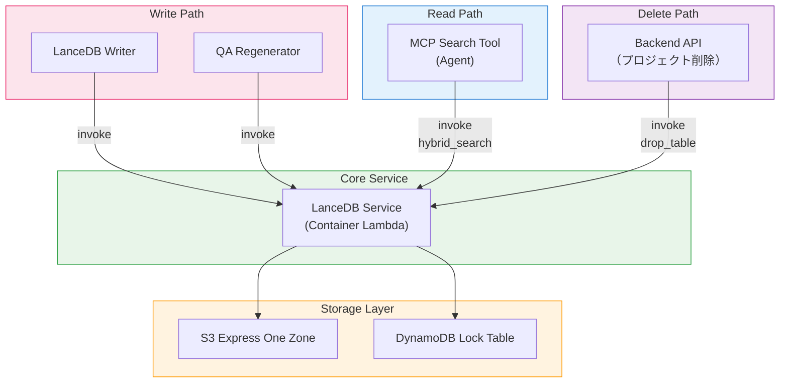

<h1 align="center">Vector Database (LanceDB + Kiwi)</h1>

<p align="center">
  <strong>サーバーレスベクトルストレージと韓国語形態素ベース検索</strong>
</p>
<p align="center">
  
  
  
  
  
</p>

<p align="center">
  <a href="VECTORDB_en.md">English</a> | <a href="VECTORDB_ko.md">한국어</a> | <strong>日本語</strong>
</p>

---

## 概要

このプロジェクトでは、Amazon OpenSearch Serviceの代わりに[LanceDB](https://lancedb.com/)をベクトルデータベースとして使用しています。LanceDBはオープンソースのサーバーレスベクトルデータベースで、データをS3に直接保存し、専用クラスターインフラが不要です。韓国語形態素解析器[Kiwi](https://github.com/bab2min/Kiwi)と組み合わせることで、韓国語対応のハイブリッド検索（ベクトル＋全文検索）を実現しています。

### PoCにLanceDBを選んだ理由

このプロジェクトは**PoC/プロトタイプ**であり、コスト効率が重要な要素です。

| 項目 | OpenSearch Service | LanceDB (S3) |
|------|-------------------|---------------|
| インフラ | 専用クラスター（最低2〜3ノード） | クラスター不要（サーバーレス） |
| アイドルコスト | 未使用時でも課金 | S3ストレージコストのみ |
| 設定の複雑さ | ドメイン構成、VPC、アクセスポリシー | S3バケット + DynamoDBロックテーブル |
| スケーリング | ノードスケーリングが必要 | S3と共に自動拡張 |
| 推定月額コスト（PoC） | $200〜500+（t3.medium x2最低） | $1〜10（S3 + DDBオンデマンド） |

> **注意**: OpenSearchはダッシュボード、k-NNプラグイン、きめ細かなアクセス制御など、本番ワークロードに適した豊富な機能を提供します。移行ガイドは[OpenSearchマイグレーション](#opensearchマイグレーション)を参照してください。

---

## アーキテクチャ

```
書き込みパス:
  Analysis Finalizer → SQS (Write Queue) → LanceDB Writer Lambda
    → LanceDB Service Lambda (Container)
        ├─ Kiwi: キーワード抽出
        ├─ Bedrock Nova: ベクトル埋め込み (1024d)
        └─ LanceDB: S3 Express One Zoneに保存

読み取りパス:
  MCP Search Tool Lambda
    → LanceDB Service Lambda (Container): ハイブリッド検索 (ベクトル + FTS)
    → Bedrock Claude Haiku: 検索結果の要約

削除パス:
  Backend API（プロジェクト削除）
    → LanceDB Service Lambda: drop_table
```

### ストレージ構造

```
S3 Express One Zone (Directory Bucket)
  └─ idp-v2/
      ├─ {project_id_1}/     ← プロジェクトごとに1つのLanceDBテーブル
      │   ├─ data/
      │   └─ indices/
      └─ {project_id_2}/
          ├─ data/
          └─ indices/

DynamoDB (Lock Table)
  PK: base_uri  |  SK: version
  └─ LanceDBテーブルの同時アクセス管理
```

---

## コンポーネント

### 1. LanceDB Service Lambda（Container Image）

ベクトルDBのコアサービスです。`lancedb`と`kiwipiepy`の合計サイズがLambdaデプロイ制限（250MB）を超えるため、Dockerコンテナイメージを使用しています。

| 項目 | 値 |
|------|-----|
| 関数名 | `idp-v2-lancedb-service` |
| ランタイム | Python 3.12（Container Image） |
| メモリ | 2048 MB |
| タイムアウト | 5分 |
| ベースイメージ | `public.ecr.aws/lambda/python:3.12` |
| 依存関係 | `lancedb>=0.26.0`, `kiwipiepy>=0.22.0`, `boto3` |

**サポートアクション:**

| アクション | 説明 |
|-----------|------|
| `add_record` | 文書セグメント追加（キーワード抽出 + 埋め込み + 保存） |
| `delete_record` | セグメントIDで削除 |
| `get_segments` | ワークフローの全セグメント取得 |
| `hybrid_search` | ハイブリッド検索（ベクトル + FTS、`query_type='hybrid'`） |
| `list_tables` | 全プロジェクトテーブル一覧 |
| `count` | プロジェクトテーブルのレコード数取得 |
| `delete_by_workflow` | ワークフローIDで全レコード削除 |
| `drop_table` | プロジェクトテーブル全体を削除 |

**Container Lambdaを使用する理由:**

Kiwiの韓国語言語モデルファイルとLanceDBのネイティブバイナリを合わせると数百MBに達し、Lambdaの250MB zip制限を超えます。Dockerコンテナイメージ（最大10GB）を使用することでこの制約を解決しています。

### 2. LanceDB Writer Lambda

分析パイプラインからの書き込みリクエストを受信し、LanceDB Serviceに委任するSQSコンシューマーです。

| 項目 | 値 |
|------|-----|
| 関数名 | `idp-v2-lancedb-writer` |
| ランタイム | Python 3.14 |
| メモリ | 256 MB |
| タイムアウト | 5分 |
| トリガー | SQS（`idp-v2-lancedb-write-queue`） |
| 同時実行数 | 1（順次処理） |

同時実行数を1に設定し、LanceDBテーブルへの同時書き込み競合を防止しています。

### 3. MCP Search Tool

AIチャット中にエージェントが文書を検索する際、LanceDB Service Lambdaを直接呼び出すMCPツールです。

```
ユーザークエリ → Bedrock Agent Core → MCP Gateway
  → Search Tool Lambda → LanceDB Service Lambda (hybrid_search)
    → Bedrock Claude Haiku: 検索結果の要約 → レスポンス
```

| 項目 | 値 |
|------|-----|
| スタック | McpStack |
| ランタイム | Node.js 22.x (ARM64) |
| タイムアウト | 30秒 |
| 環境変数 | `LANCEDB_FUNCTION_ARN`（SSM経由） |

---

## データスキーマ

各文書セグメントは以下のスキーマで保存されます:

```python
class DocumentRecord(LanceModel):
    workflow_id: str            # ワークフローID
    document_id: str            # 文書ID
    segment_id: str             # "{workflow_id}_{segment_index:04d}"
    segment_index: int          # セグメントページ/チャプター番号
    content: str                # content_combined（埋め込みソースフィールド）
    vector: Vector(1024)        # Bedrock Nova埋め込み（ベクトルフィールド）
    keywords: str               # Kiwi抽出キーワード（FTSインデックス）
    file_uri: str               # 元ファイルS3 URI
    file_type: str              # MIMEタイプ
    image_uri: Optional[str]    # セグメント画像S3 URI
    created_at: datetime        # タイムスタンプ
```

- **プロジェクトごとに1テーブル**: テーブル名 = `project_id`
- **`content`**: 全前処理結果を統合したテキスト（OCR + BDA + PDFテキスト + AI分析）
- **`vector`**: LanceDB埋め込み関数で自動生成（Bedrock Nova、1024次元）
- **`keywords`**: Kiwiで抽出した韓国語形態素（FTSインデックス）

---

## Kiwi: 韓国語形態素解析器

[Kiwi (Korean Intelligent Word Identifier)](https://github.com/bab2min/Kiwi)はC++で書かれたオープンソースの韓国語形態素解析器で、Pythonバインディング（`kiwipiepy`）を提供しています。

### Kiwiを使用する理由

LanceDBの内蔵FTSトークナイザーは韓国語をサポートしていません。韓国語は膠着語であり、スペースだけでは単語を分離できません。例:

```
入力:  "인공지능 기반 문서 분석 시스템을 구축했습니다"
Kiwi:  "인공 지능 기반 문서 분석 시스템 구축"（名詞のみ抽出）
```

形態素分析なしでは、「시스템」で検索しても「시스템을」や「시스템에서」を含む文書を見つけることができません。

### 抽出ルール

| 品詞タグ | 説明 | 例 |
|---------|------|-----|
| NNG | 一般名詞 | 문서, 분석, 시스템 |
| NNP | 固有名詞 | AWS, Bedrock |
| NR | 数詞 | 하나, 둘 |
| NP | 代名詞 | 이것, 그것 |
| SL | 外国語 | Lambda, Python |
| SN | 数字 | 1024, 3.5 |
| SH | 漢字 | |
| XSN | 接尾辞 | 前のトークンに結合（例: 생성+형 → 생성형） |

**フィルター:**
- 1文字韓国語ストップワード: 것, 수, 등, 때, 곳
- 1文字の外国語、数字、漢字は保持

---

## ハイブリッド検索フロー

すべての検索はLanceDB Service Lambdaで処理されます。LanceDBのネイティブ`query_type='hybrid'`を使用してベクトル検索と全文検索を統合します。

```
検索クエリ: "문서 분석 결과 조회"
  │
  ├─ [1] Kiwiキーワード抽出（LanceDB Service Lambda）
  │     → "문서 분석 결과 조회"
  │
  ├─ [2] LanceDBネイティブハイブリッド検索
  │     → table.search(query=keywords, query_type='hybrid')
  │     → ベクトル検索（Nova埋め込み）+ FTS自動マージ
  │     → Top-K結果（_relevance_score）
  │
  └─ [3] 結果の要約（MCP Search Tool Lambda）
        → Bedrock Claude Haikuで検索結果に基づく回答を生成
```

---

## インフラ（CDK）

### S3 Express One Zone

```typescript
// StorageStack
const expressStorage = new CfnDirectoryBucket(this, 'LanceDbExpressStorage', {
  bucketName: `idp-v2-lancedb--use1-az4--x-s3`,
  dataRedundancy: 'SingleAvailabilityZone',
  locationName: 'use1-az4',
});
```

S3 Express One Zoneは一桁ミリ秒のレイテンシを提供し、ベクトル検索のような頻繁な読み書きパターンに最適化されています。

### DynamoDB Lock Table

```typescript
// StorageStack
const lockTable = new Table(this, 'LanceDbLockTable', {
  partitionKey: { name: 'base_uri', type: AttributeType.STRING },
  sortKey: { name: 'version', type: AttributeType.NUMBER },
  billingMode: BillingMode.PAY_PER_REQUEST,
});
```

複数のLambda関数が同じデータセットに同時アクセスする際の分散ロックを管理します。

### SSMパラメータ

| キー | 説明 |
|------|------|
| `/idp-v2/lancedb/lock/table-name` | DynamoDBロックテーブル名 |
| `/idp-v2/lancedb/express/bucket-name` | S3 Expressバケット名 |
| `/idp-v2/lancedb/express/az-id` | S3 Express可用性ゾーンID |
| `/idp-v2/lancedb/function-arn` | LanceDB Service Lambda関数ARN |

---

## コンポーネント依存関係マップ

LanceDBに依存するすべてのコンポーネントを示したダイアグラムです:



| コンポーネント | スタック | アクセスタイプ | 説明 |
|--------------|--------|-------------|------|
| **LanceDB Service** | WorkflowStack | 読み書き | コアDBサービス（Container Lambda） |
| **LanceDB Writer** | WorkflowStack | 書き込み（Service経由） | SQSコンシューマー、Serviceに委任 |
| **Analysis Finalizer** | WorkflowStack | 書き込み（SQS/Service経由） | セグメントを書き込みキューに送信、再分析時に削除 |
| **QA Regenerator** | WorkflowStack | 書き込み（Service経由） | Q&Aセグメント更新 |
| **MCP Search Tool** | McpStack | 読み取り（Service直接呼び出し） | エージェント文書検索ツール |
| **Backend API** | ApplicationStack | 削除（Service経由） | プロジェクト削除時に`drop_table`を呼び出し |

---

## OpenSearchマイグレーション

本番環境でAmazon OpenSearch Serviceに移行する場合、以下のコンポーネントの修正が必要です。

### 交換対象コンポーネント

| コンポーネント | 現在（LanceDB） | 変更後（OpenSearch） | 範囲 |
|--------------|----------------|---------------------|------|
| **LanceDB Service Lambda** | Container Lambda + LanceDB | OpenSearchクライアント（CRUD + 検索） | 全面交換 |
| **LanceDB Writer Lambda** | SQS → LanceDB Service呼び出し | SQS → OpenSearchインデックス書き込み | 呼び出し先交換 |
| **MCP Search Tool** | Lambda invoke → LanceDB Service | Lambda invoke → OpenSearch検索 | 呼び出し先交換 |
| **StorageStack** | S3 Express + DDBロックテーブル | OpenSearchドメイン（VPC） | リソース交換 |

### 変更不要コンポーネント

| コンポーネント | 理由 |
|--------------|------|
| **Analysis Finalizer** | SQSにメッセージ送信のみ（キューインターフェース不変） |
| **Frontend** | DB直接アクセスなし |
| **Step Functions Workflow** | LanceDB直接依存なし |

### マイグレーション戦略

```
Phase 1: ストレージ層の交換
  - VPC内にOpenSearchドメインを作成
  - StorageStackリソース交換（S3 Express + DDBロック削除）
  - 韓国語トークン化のためのNori分析器設定

Phase 2: 書き込みパスの交換
  - LanceDB Service → OpenSearchインデクシングサービスに変更
  - 文書スキーマ変更（OpenSearchインデックスマッピング）
  - 埋め込み用OpenSearch neural ingest pipeline追加

Phase 3: 読み取りパスの交換
  - MCP Search Tool LambdaのinvokeターゲットをOpenSearch検索サービスに変更
  - Kiwi依存関係削除（Noriが韓国語トークン化を処理）

Phase 4: LanceDB依存関係の削除
  - requirementsからlancedb, kiwipiepyを削除
  - Container Lambda削除（通常Lambdaで対応可能）
  - S3 ExpressバケットおよびDDBロックテーブルの削除
```

### 主要考慮事項

| 項目 | 内容 |
|------|------|
| 韓国語トークン化 | OpenSearchには[Nori分析器](https://opensearch.org/docs/latest/analyzers/language-analyzers/#korean-nori)が内蔵されておりKiwi削除可能 |
| ベクトル検索 | OpenSearch k-NNプラグイン（HNSW/IVF）がLanceDBベクトル検索を代替 |
| 埋め込み | OpenSearch neural searchでingest pipelineから自動埋め込み可能、または事前計算済み埋め込みを使用 |
| コスト | OpenSearchは稼働中のクラスターが必要。HAのための最低2ノードクラスター |
| SQSインターフェース | SQS書き込みキューパターンは維持可能、コンシューマーロジックのみ変更 |

---

## ライセンス

このプロジェクトは[Amazon Software License](../../LICENSE)の下でライセンスされています。
